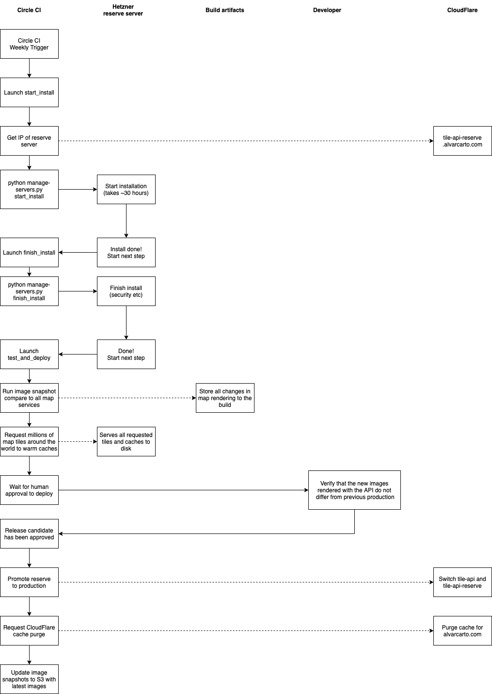

# Map server

Requirements:

* Fresh Ubuntu 18.04 installation
* At least 16GB RAM for the installation phase. 32GB minimum is recommended for production.
* 450GB disk space (tested: 350GB disk space was not enough)

The full planet import should be done in a dedicated Hetzner server.

This package will:

* Install Mapnik and tile serving plugins
* Install Postgres 10 with Postgis extension
* Install Mapnik & OSM data related tools
* Download [latest planet OSM data](http://planet.openstreetmap.org/)
* Download necessary shapefiles required by [openstreetmap-carto](https://github.com/gravitystorm/openstreetmap-carto) and our themes

    All Mapnik stylesheets should be modified to reference to following files:

    * `$ALVAR_MAP_SERVER_DATA_DIR/land-polygons-split-3857/land_polygons.shp`
    * `$ALVAR_MAP_SERVER_DATA_DIR/simplified-land-polygons-complete-3857/simplified_land_polygons.shp`
    * `$ALVAR_MAP_SERVER_DATA_DIR/ne_10m_admin_0_boundary_lines_land/ne_10m_admin_0_boundary_lines_land.shp`
    * `$ALVAR_MAP_SERVER_DATA_DIR/ne_110m_admin_0_countries/ne_110m_admin_0_countries.shp`

    Where `$ALVAR_MAP_SERVER_DATA_DIR` is the directory specified in [install.sh](install.sh)
    variables. The default is `/home/alvar/data`.
    Note that changing this may require to change this path in render/tile service code.
* Install Google Fonts
* Simplify downloaded .shp files using `shapeindex`.
* Import latest OSM data to Postgis server using [osm2psql](github.com/openstreetmap/osm2pgsql). [imposm3](https://github.com/omniscale/imposm3) was an alternative but openstreetmap style worked better.


## Local development with Docker

**WARNING:** Docker container is unsafe for production, sudo commands without password are allowed

**Requirements:** At least 8GB RAM for Docker.

Run command below to start postgres with map data from Finland loaded:

```bash
docker-compose build
docker-compose up postgres
```

### Rebuild docker image

Note: you need to comment or lines or rename `.env` with docker-compose version <1.26.0. See https://github.com/docker/compose/issues/6511.

```bash
docker-compose down && docker-compose rm && docker system prune
docker-compose build --no-cache
docker-compose up postgres
```


## Production installation process

The process has been automated to a CI task. See [.circleci/config.yml](.circleci/config.yml).

Idea is that we have two servers, which are switched between "production" and "reserve". We automatically
re-install the server and deploy new version to production with Circle CI cron trigger. The process is:

* Order a reinstall to the reserve server via Hetzner API
* Wait until server is responsive
* Initial setup of the machine
* Copy this repo into the server and run install.sh inside a screen
* Wait for the server installation to finish
* Restrict security after installation (sudo needs password etc)
* Reboot server to verify all services start after reboot
* Wait until server is responsive
* Run snapshot tool to verify differences between production and new installation
* Warm tile caches inside the server
* Wait for developer approval
* If approval is give, point the freshly installed server to tile-api.alvarcarto.com
* Invalidate everything from CloudFlare cache


### Diagram of the deployment process

Diagram tries to capture the process in an overview. See Circle CI config for exact details.




*Open the PNG in draw.io to edit*


## Common tasks

### Reload pm2 config

```bash
nvm use 10
pm2 stop all
pm2 delete all
cd $HOME/alvarcarto-map-server

pm2 start confs/pm2.json

# Check that everything went allright
pm2 logs --lines 1000

# Then save the startup:
sudo env PATH=$PATH:/home/alvar/.nvm/versions/node/v10.20.1/bin /home/alvar/.nvm/versions/node/v10.20.1/lib/node_modules/pm2/bin/pm2 startup systemd -u alvar --hp /home/alvar
pm2 save

```


### Investigate Caddy problems

**HTTP Access logs:**

`cat /var/log/access.log`

**Caddy errors:**

`sudo cat /var/log/syslog` or `sudo journalctl -u caddy | tail -n 300`

**Edit Caddyfile:**

```
sudo nano /etc/caddy/Caddyfile
sudo systemctl restart caddy
```

**Edit /etc/systemd/system/caddy.service**

```bash
sudo nano /etc/systemd/system/caddy.service
sudo systemctl daemon-reload
sudo systemctl restart caddy
```


## Known errors

### Mapnik `make test` fails

First it may fail to: `Postgis Plugin: FATAL:  role "alvar" does not exist`.

Fix:
```
sudo su postgres
psql
CREATE USER alvar;
ALTER USER alvar CREATEDB;
```

Then it may fail to: `ERROR (Postgis Plugin: FATAL:  database "template_postgis" does not exist`.

Fix, create postgis_template:

```
sudo su postgres
createdb template_postgis -E UTF-8
createlang plpgsql template_postgis  # may say this is already done
psql -d template_postgis -f /usr/share/postgresql/9.5/contrib/postgis-2.2/postgis.sql
psql -d template_postgis -f /usr/share/postgresql/9.5/contrib/postgis-2.2/spatial_ref_sys.sql
psql
UPDATE pg_database SET datistemplate = TRUE WHERE datname = 'template_postgis';
```

Or read more how to create template_postgis: https://wiki.archlinux.org/index.php/PostGIS


### Network is very slow

https://askubuntu.com/questions/574569/apt-get-stuck-at-0-connecting-to-us-archive-ubuntu-com

```
sudo nano /etc/gai.conf
```

and change line ~54 to uncomment the following:

```
precedence ::ffff:0:0/96  100
```

**Note: NOT THIS LINE: `precedence ::ffff:0:0/96  10`**


### Benchmark server

https://github.com/n-st/nench


